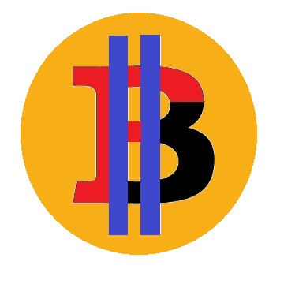
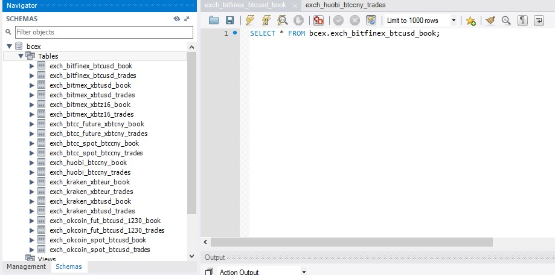
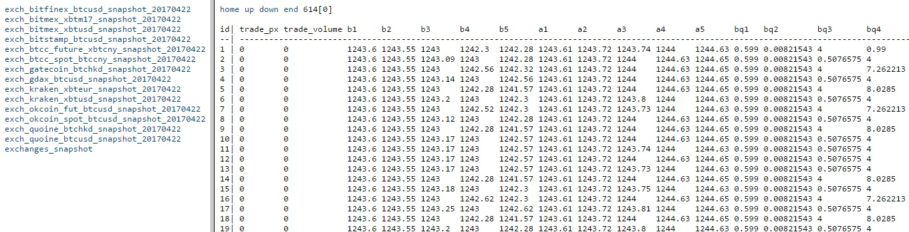

<p align="center">
  
</p>

# BitcoinExchangeFH - Bitcoin exchange market data feed handler

BitcoinExchangeFH is a slim application to record the price depth and trades in various exchanges. You can set it up quickly and record the all the exchange data in a few minutes!

Users can

1. Streaming market data to a target application (via ZeroMQ)
2. Recording market data for backtesting and analysis.
3. Recording market data to a in-memory database and other applications can quickly access to it.
4. Customize the project for trading use.

### MySQL

<p align="center">
  
</p>

### Kdb+

<p align="center">
  
</p>

## Supported exchanges

- Bitfinex (Websocket)
- BitMEX (Websocket)
- Bitstamp (Websocket)
- BTCC (RESTful)
- Gatecoin (RESTful)
- GDAX (Websocket)
- Kraken (RESTful)
- OkCoin (Websocket)
- Quoine (RESTful)
- Poloniex (RESTful)
- Bittrex (RESTful)
- Yunbi (RESTful)

Currently the support of other exchanges is still under development.

Scheduled exchange supported soon:
- xBTCe
- DABTC
- FX rate (USDCNY, EURUSD)

## Supported database/channel

- ZeroMQ
- Kdb+
- MySQL
- PostgreSQL 9.5+
- Sqlite
- CSV

## Getting started

It is highly recommended to use pip for installing python dependence.

```
pip install bitcoinexchangefh
```

If your operation system has pythons with version 2 and 3, please specify
pip3 for python 3 installation.

```
pip3 install bitcoinexchangefh
```

### Destination

#### Applications

You can write your application to receive the market data via ZeroMQ socket.

BitcoinExchangeFH acts as a publisher in the
[Publish/Subscibe](http://learning-0mq-with-pyzmq.readthedocs.io/en/latest/pyzmq/patterns/pubsub.html) model.
You can open a TCP or inter-process traffic.

For example, if you decide the data feed is subscribed at 127.0.0.1 at port 6001.

```
bitcoinexchangefh -zmq -zmqdest "tcp://127.0.0.1:6001" -instmts subscription.ini
```

According to [zmq-tcp](http://api.zeromq.org/2-1:zmq-tcp), please provide "127.0.0.1"
instead of "localhost" as the local machine destination.

If the data feed is subscribed via inter-process shared memory with address "bitcoin".

```
bitcoinexchangefh -zmq -zmqdest "ipc://bitcoin" -instmts subscription.ini
```

#### Sqlite

No further setup is required. Just define the output sqlite file.

For example, to record the data to default sqlite file "bitcoinexchange.raw", run the command

```
bitcoinexchangefh -sqlite -sqlitepath bitcoinexchangefh.sqlite -instmts subscription.ini
```

#### Kdb+

First, start your Kdb+ database. You can either choose your own binary or the binary in the [third-party](https://github.com/gavincyi/BitcoinExchangeFH/tree/master/third-party) folder.

```
q -p 5000
```

Then connect to the database with dedicated port (for example 5000 in the example).

For example connecting to localhost at port 5000, run the command

```
bitcoinexchangefh -kdb -kdbdest "localhost:5000" -instmts subscription.ini
```

#### MySQL

To store the market data to MySQL database, please install [mysql-server](https://dev.mysql.com/downloads/mysql/) first. Then enable the following user privileges on your target schema

```
CREATE
UPDATE
INSERT
SELECT
```

For example connecting to localhost with user "bitcoin", password "bitcoin" and schema "bcex", run the command

```
bitcoinexchangefh -mysql -mysqldest "bitcoin:bitcoin@localhost:3306" -mysqlschema bcex -instmts subscription.ini
```

#### PostgreSQL

To store the market data to PostgreSQL database, please install [postgresql-server](https://www.postgresql.org/) first. Make sure that the installed version is at least 9.5. Then enable the following user privileges on your target database and schema

```
CREATE
UPDATE
INSERT
SELECT
```

For example connecting to localhost with user "bitcoin", password "bitcoin", database "bcex" and schema "public", run the command

```
bitcoinexchangefh -pg -pgdest "bitcoin:bitcoin@localhost:5432/bcex" -pgschema public -instmts subscription.ini
```

#### CSV

No further setup is required. Just define the output folder path.

For example to a folder named "data", you can run the following command.

```
bitcoinexchangefh -csv -csvpath data/ -instmts subscription.ini
```

### Multiple destination

Bitcoinexchangefh supports multiple destinations.

For example, if you store the market data into the database and, at the same time, publish the data through ZeroMQ publisher, you can run the command

```
bitcoinexchangefh -zmq -zmqdest "tcp://localhost:6001" -kdb -kdbdest "localhost:5000" -instmts subscription.ini
```

### Arguments

|Argument|Description|
|---|---|
|mode|Please refer to [Mode](#mode)|
|instmts|Instrument subscription file.|
|exchtime|Use exchange timestamp if possible.|
|zmq|Streamed with ZeroMQ sockets.|
|zmqdest|ZeroMQ destination. Formatted as "type://address(:port)", e.g. "tcp://127.0.0.1:6001".|
|kdb|Use Kdb+ database.|
|kdbdest|Kdb+ database destination. Formatted as "address:port", e.g. "127.0.0.1:5000".|
|sqlite|Use SQLite database.|
|sqlitepath|SQLite database file path, e.g. "bitcoinexchangefh.sqlite".|
|mysql|Use MySQL.|
|mysqldest|MySQL database destination. Formatted as "username:password@address:host", e.g. "peter:Password123@127.0.0.1:3306".|
|pg|Use PostgreSQL.|
|pgdest|PostgreSQL database destination. Formatted as "username:password@address:host/database", e.g. "peter:Password123@127.0.0.1:5432/bcxe".|
|pgschema|PostgreSQL destination schema. Default "public".|
|csv|Use CSV file as database.|
|csvpath|CSV file directory, e.g. "data/"|
|output|Verbose output file path.|

### Subscription
All the instrument subscription are mentioned in the configuration file [subscriptions.ini](subscriptions.ini). For supported exchanges, you can include its instruments as a block of subscription.

|Argument|Description|
|---|---|
|(block name)|Unique subscription ID|
|exchange|Exchange name.|
|instmt_name|Instrument name. Used in application, e.g. database table name|
|instmt_code|Exchange instrument code. Used in exchange API|
|enabled|Indicate whether to subscribe it|

### Market Data

All market data are stored in the dedicated database. For each instrument, there are two tables, order book and trades. The order book is the price depth at top five levels. They are recorded under the table names of

```
exch_<exchange name>_<instrument name>_snapshot
```

### Output

Each record (in any output format e.g. CSV/SQLite/KDB+/etc) indicates either a new trade or a change in the order book.

The column definition is as follows:

|Name|Description|
|---|---|
|trade_px|Last trade price|
|trade_volume|Last trade volume|
|b\<n\>, a\<n\>|Best bid and ask prices, where n is between 1 and 5|
|bq\<n\>, aq\<n\>|Best bid and ask volumes, where n is between 1 and 5|
|update_type|Update type. 1 indicates price depth update, and 2 indicates trade update|
|order_date_time, trade_date_time|Last update time for the price depth and the trades|

## Inquiries

You can first look up to the page [FAQ](https://github.com/gavincyi/BitcoinExchangeFH/wiki/FAQ). For more inquiries, you can either leave it in issues or drop me an email. I will get you back as soon as possible.

## Compatibility
The application is compatible with version higher or equal to python 3.0.

## Contributions
Always welcome for any contribution. Please fork the project, make the changes, and submit the merge request. :)

For any questions and comment, please feel free to contact me through email (gavincyi at gmail)

Your comment will be a huge contribution to the project!

## Continuity
If you are not satisified with python performance, you can contact me to discuss migrating the project into other languages, e.g. C++.
